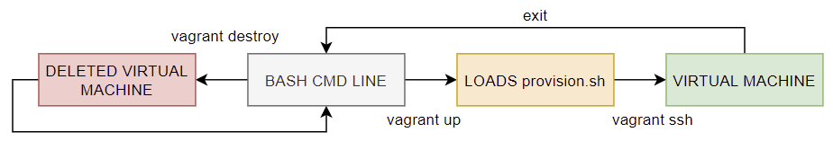
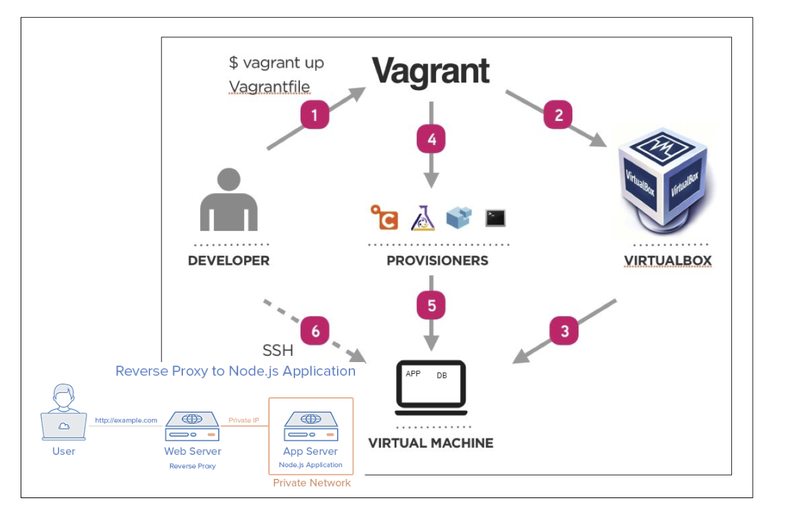

# DevOps Bootcamp

## Introduction to DevOps

- Breaking down silos and bringing developers and operations closer together
- Share responsibilities 
- Deploy infrastructure as code
- Automate the deployment pipleine as much as possible
- Supported by strong CI/CD pratices

## Linux commands that also work on Bash

### Folder and Command Line

- Create a dir `mkr name_of_the_dir`.
- Go inside the dir `cd name_of_the_dir`.
- Come out of the dir `cd ..` or `cd`.
- Who am I `uname -a`.
- Where am I `pwd`.
- Create a file `touch name_of_the_file` or `nano file_name` you land inside the file.
- Exit nano `ctrl x` then `y` then `enter`.
- List all `ls -a` or `ls`.
- To see the content of the file on the terminal `cat file_name`.
- Clear your screen `clear`.
- Delete a file `rm -rf name_of_the_file`.
- Delete a folder `rm -d directory_name` or `rmdir directory`.

### Linux Systems / Programs

- To update the linux system `sudo apt-get update -y`.
- To install nginx `sudo apt-get install nginx -y`.
- To uninstall nginx `sudo apt-get remove nginx -y`.

### More Linux

- To see processes `top`.
- To become root user `sudo su`.
- To see the history of commands `history`.
- To check the status of a process `systemctl status process_name`.
- To stop a process `systemctl stop process_name`.
- To restart a process `systemctl restart process_name`.
- To make a script you must write `#!/bin/bash` at the start of the file and use a `.sh` file type.
- To run a file type `sudo bash ./file_name.sh`.
- To change a files mode to executable `sudo chmod +x file_name.sh`.
- Once executable, run a script by making it `sudo ./provision.sh`.
- To see environment variables `printenv` or `printenv variable_name`.
- To create an environment variable `export name_of_variable=value`

### Vagrant

- To initialise vagrant `vagrat init`.
- To start vagrant `vagrant up`.
- To SSH into vagrant `vagrant ssh`.
- To suspend the vagrant `vagrant suspend`.
- To reload vagrant `vagrant reload`.
- To destroy vagrant `vagrant destroy`.

### Permissions 

```
Linux permissions dictate 3 things you may do with a file, read, write and execute. They are referred to in Linux by a single letter each.

__r__ (read) - you may view the contents of the file.
__w__ (write) - you may change the contents of the file.
__x__ (execute) - you may execute or run the file if it is a program or script.

For every file we define 3 sets of people for whom we may specify permissions.

--- Owner ---

The user who owns the file. Typically the person who created the file but ownership can be changed.

--- Group ---

Every file belongs to a single group. Groups can have many users in it so you can give access to multiple people.

--- Others ---

Everyone else who is not in the group or the owner.
Three persmissions and three groups of people. That's about all there is to permissions really. Now let's see how we can view and change them.

--- View Permissions ---

To view permissions for a file we use the long listing option for the command ls.
ls -l [path]

--- Change Permissions ---

To change permissions on a file or directory we use a command called "chmod" It stands for change file mode bits which is a bit of a mouthfull but think of the mode bits as the permission indicators.
chmod [permissions] [path]
chmod has permission arguments that are made up of 3 components
There are two ways you can use chmod and you will see both used. One is shorter and one is more descriptive.
```

## Diagrams

### Flow Diagram for Vagrant


### Vagrant Structure

